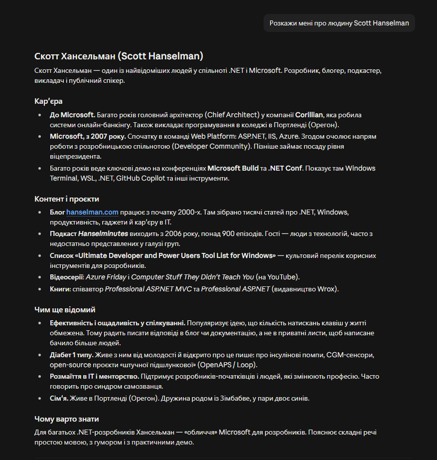
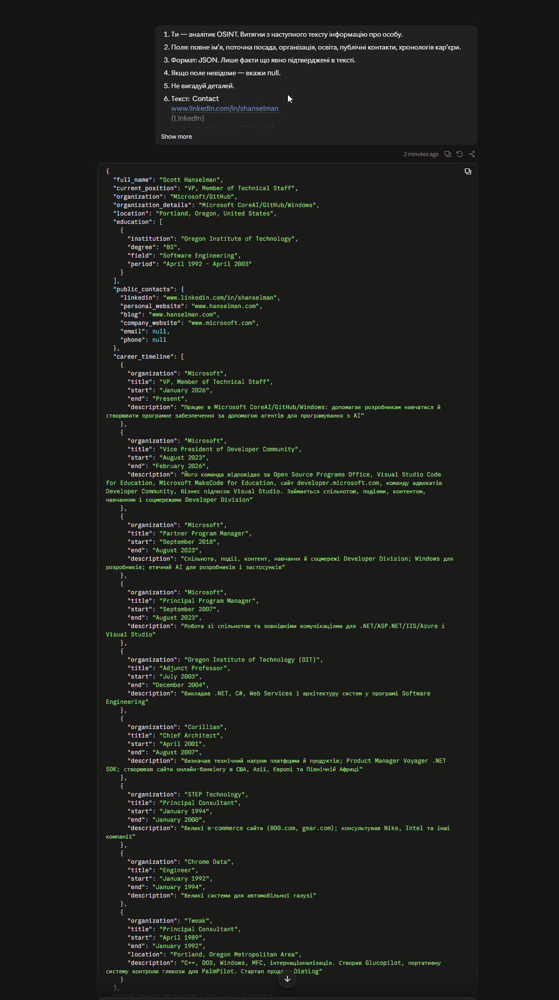

## Базовий рівень 1.

1. Поганий промпт - Результат:

В даному випадку LLM робить прості висновки; відповідь структурована, але сама структура залежить від LLM; зібрана основна інформація про людину.

2. Структурований промпт - Результат:

В даному випадку відповідь має чітку форму; відсутні висновки про людину.